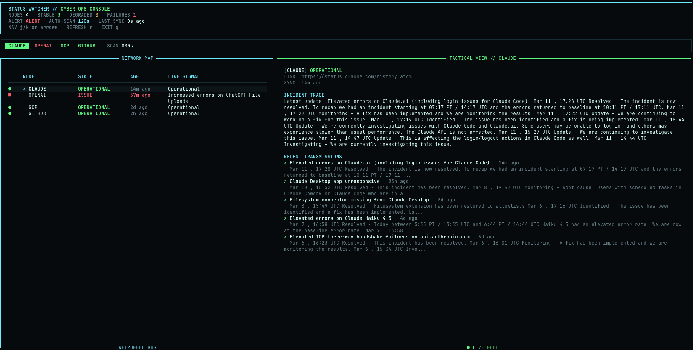

# Status Watcher

`status-watcher` is a terminal dashboard for monitoring public service status feeds and status pages. It turns Atom/RSS history feeds into a live retro-cyber console and now supports structured API/JSON sources plus component-aware status drilldowns.



## Features

- Rich terminal UI with keyboard navigation and auto-refresh
- Atom and RSS feed support out of the box
- Generic Atlassian Statuspage adapter for public `summary.json` and incident timelines
- Configurable JSON/API adapter with nested field-path extraction for incidents and components
- DOM-based HTML adapter with optional simple selectors for targeted status blocks
- Persistent per-service change history across refreshes and restarts
- Structured component tracking, impacted-component counts, and component-aware detail view
- Retry/backoff plus last-known-good response caching for flaky sources
- Adapter registry for future source types
- Backward-compatible `feeds.json` config
- Centralized incident normalization and status inference

## Current Status

This project is still early-stage (`0.2.0`), but it now has a more complete ingestion surface:

- Feed-based sources remain supported
- Public Statuspage sites expose incidents plus tracked components
- Generic JSON sources can map nested payloads into incidents and components
- HTML sources can use DOM-based extraction with optional selectors instead of the older title/body scrape only

## Installation

### Local checkout

```bash
python3 -m venv .venv
source .venv/bin/activate
pip install -e .
```

### Run

```bash
status-watcher
```

You can also run it directly from the repo:

```bash
python3 tui.py
python3 -m status_watcher
```

By default the app persists history to `~/.status-watcher/state.json`. Set `STATUS_WATCHER_STATE_PATH` to override that path.
By default the app caches last-known-good source responses under `~/.status-watcher/cache`. Set `STATUS_WATCHER_CACHE_DIR` to override that path.

## Configuration

By default the app loads `./feeds.json` when present. If that file does not exist, it falls back to built-in defaults.

You can also pass an explicit config path:

```bash
status-watcher path/to/feeds.json
```

### Config format

Minimal feed entry:

```json
[
  {
    "name": "GitHub",
    "url": "https://www.githubstatus.com/history.atom"
  }
]
```

Explicit source types:

```json
[
  {
    "name": "Claude",
    "type": "statuspage",
    "url": "https://status.claude.com"
  },
  {
    "name": "GitHub",
    "type": "feed",
    "url": "https://www.githubstatus.com/history.atom"
  },
  {
    "name": "Example HTML Status",
    "type": "html",
    "url": "https://example.com/status",
    "selectors": [".incident"],
    "component_selectors": [".component"]
  },
  {
    "name": "Example API Status",
    "type": "json",
    "url": "https://status.example.com/api/status.json",
    "entries_path": "data.events[]",
    "components_path": "data.components[]",
    "summary_path": "details.text"
  }
]
```

`type` is optional and defaults to `feed`.

Statuspage sources also accept `recent_incidents` to control how much recent incident history is pulled from `incidents.json`.

### JSON source options

The `json` adapter is config-driven. The most useful options are:

- `entries_path`: path to the list of incident/update objects
- `components_path`: path to the list of component objects
- `title_path`, `summary_path`, `updated_path`, `link_path`: field paths for incident entries
- `component_name_path`, `component_status_path`, `component_details_path`, `component_updated_path`, `component_link_path`: field paths for components
- `headers`: optional request headers
- `accept`: optional override for the request `Accept` header

Path syntax supports dotted traversal plus list extraction, for example `data.events[]` or `incidents[].updates[]`.

### HTML source options

The `html` adapter can work heuristically, but it is much more reliable with selectors.

- `selectors` or `entry_selectors`: list of simple selectors for incident/update blocks
- `component_selectors`: list of simple selectors for component blocks

Supported selectors are intentionally small: tag names, `.class`, `#id`, `tag.class`, `tag#id`, and `[attr=value]`.

## Architecture

The codebase is split into a few small layers:

- `status_watcher.config`: config loading, defaults, runtime constants
- `status_watcher.domain`: normalized feed parsing helpers, incident matching, status inference, and component normalization
- `status_watcher.history`: persisted snapshots and change detection
- `status_watcher.sources`: source adapters, fetch/cache helpers, and adapter registry
- `status_watcher.monitor`: load pipeline and service-level error mapping
- `status_watcher.ui`: Rich rendering
- `status_watcher.app`: terminal event loop and application entrypoint

Contributors adding new source types should focus on the adapter layer. Adapters should produce normalized `FeedEntry` records plus optional component snapshots and leave status classification to the domain layer.

## Development

Install and run tests:

```bash
pip install -e .
python3 -m unittest discover -s tests
```

## Releases

This repository uses conventional commits via PR titles and Release Please for automated release PRs.

- Open PRs with conventional titles such as `feat(sources): add statuspage api adapter` or `fix(domain): handle resolved incidents`
- Squash merge PRs into `main`
- Let Release Please open the release PR that updates the version and `CHANGELOG.md`
- Merge the Release Please PR to create the GitHub release and tag

## Roadmap

- Headless watch mode and alert delivery
- More provider presets built on top of the JSON/HTML adapters
- Better screenshots/demo assets for the README

## Limitations

- Status inference is heuristic and source-dependent
- The generic JSON adapter depends on correct field-path mapping for each provider
- The HTML adapter only supports a small selector subset and still benefits from source-specific tuning
- The dashboard is terminal-first and not intended as a library API yet

## License

MIT. See [LICENSE](LICENSE).
